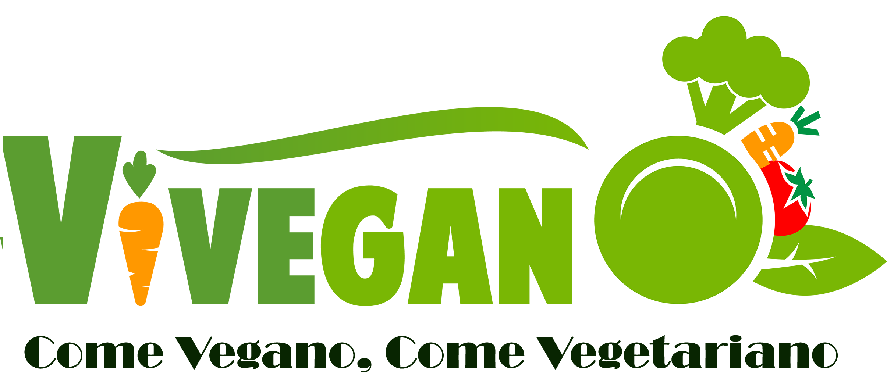

# Retos de codigo

* **Track:** _Common Core_
* **Curso:** _Crea tu propia red Social_
* **Unidad:** _Agiliza tu desarrollo_

***
# Pagina Responsive-FOOD MAP.

## COME SANO COME VEGANO.

 

# OBJETIVO.

Crear una pàgina Responsive Informativa, de restaurantes Veganos y vegetarianos, su ubicaciòn Lima Metropolitana.

## Tècnologia utilizada:

* - BOOTSTRAP.
* - CSS3.
* - HTML5.
* - JQUERY.

## Desarrollo
1. Se crea la estructura de la página.
2. Definicion de colores.
3. Maquetaciòn.
4. Funcionalidad.
5. Configuracion de GitHubs.
6. Creaciòn repositorio remoto.
7. Pagina gh-pages.